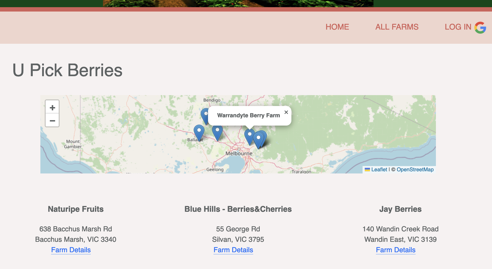
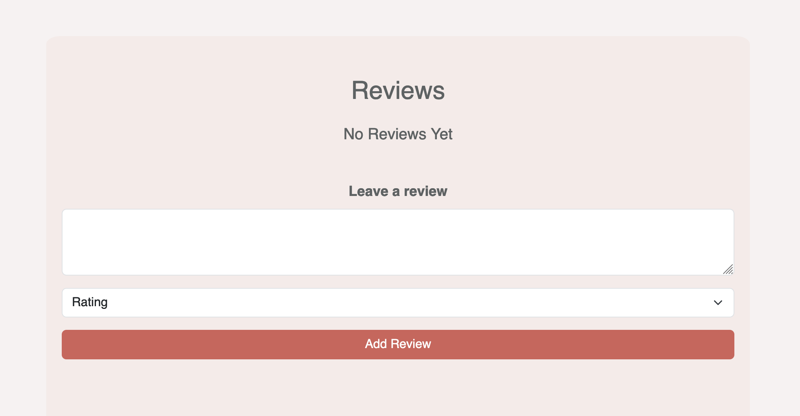
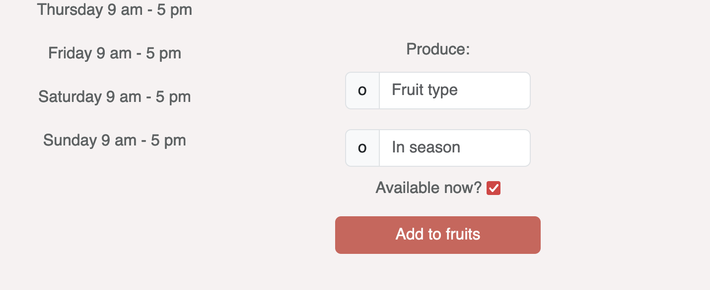

Pick your own berries - Farms near you
======================

The application provides an overview of fruit producing businesses where customers can visit and pick their own fruits. The website focuses on berries (for now).

Details
----------------------

A map (API OpenStreetMap) on a summary page shows the locations/addresses of all farms (brief description below). 

Clicking on `Farm details` below any farm leads to a page that shows more information on the individual farm. Information include picking hours and current availability of fruits grown at the farm.

Below a section is dedicated to customer reviews. Anyone can see reviews that have been posted for the given farm. Additionally, customers can leave a review and share their experience. This does not require lgging in.

If users sign up/log in to the application (navigation - top right link), they can access the `ADD FARM`  sub-page that allows them to add a new farm to the collection. Additionally, a form on the 'details-page' allows adding fruit and its current availability to the produce section.

The application uses OAuth 2.0 (google API) for user authentication.

# Technologies

- NodeJS
- Express
- Mongo.DB
- Bootstrap
- API Calls

# Deployment 

The application is deployed at www.heroku.com. 

Click this link to open the website:
https://new-berry-farm-e0a2e7e09b08.herokuapp.com/

### Next steps...

- Modify `All Farms` page to only show farms that are currently visible on the map
- include `update` and `delete` functionality (for farms and produce)
- include photos 
- (Potentially) include an API to show weather at farm location 

